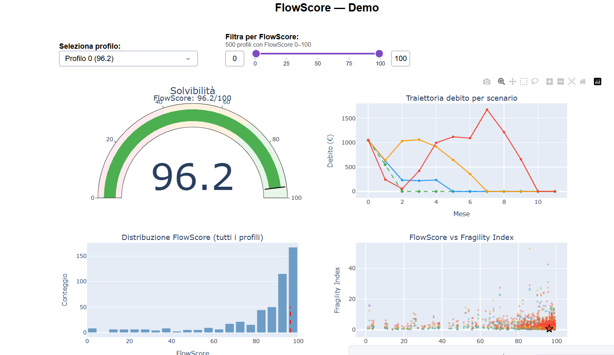
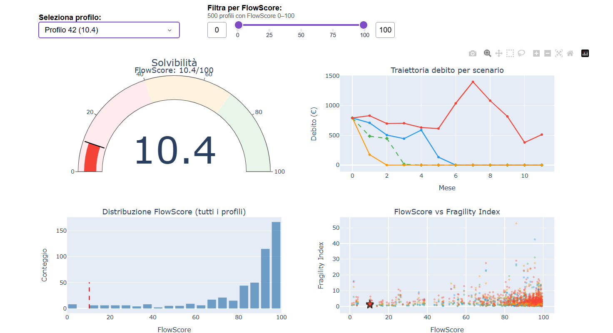
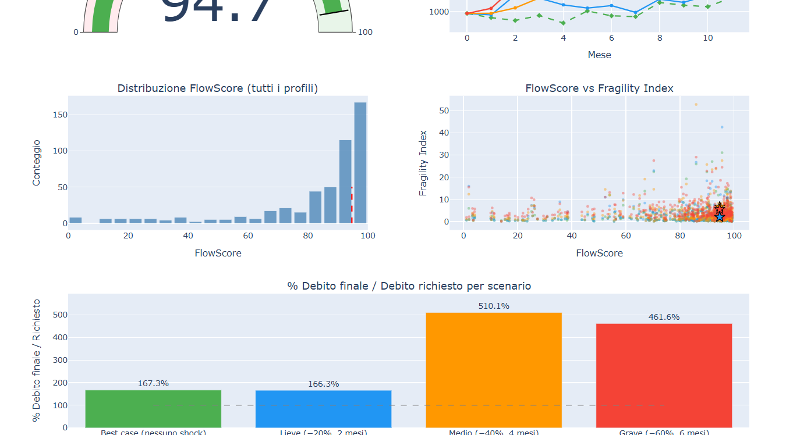

# FlowScore — Alternative Credit Scoring for Gig Workers

Hackathon project exploring cash-flow-based credit scoring as alternative to traditional credit history for underbanked Italian freelance and gig workers.

---

🏆 SkillBoost Lab Hackathon 2026 · Team project · March 2026

---


*Interactive Dash dashboard — profile 0 (FlowScore 96.2, solvent under all shock scenarios)*

---

## The Problem

Around 4 million Italian gig workers and freelancers are underbanked — not because they are financially irresponsible, but because traditional credit scoring relies on credit history they simply don't have. Irregular income, multiple clients, and no payslips make them invisible to conventional models even when their actual cash flow is healthy.

FlowScore replaces credit history with cash-flow pattern analysis: income volatility, liquidity buffers, fixed-cost exposure, and resilience to income shocks. The goal is a score that reflects financial behavior, not financial conformity.

---

## Architecture

Three independent layers connected by CSV data contracts — no cross-language runtime dependencies, each built independently by a different team member:

**Layer 1 — Synthetic data engine (Python / SimPy)**
Generates 500 synthetic gig-worker profiles over 6 months, sampling income volatility, fixed-cost ratios, liquidity buffers, BNPL exposure, income trend, and initial debt from empirically grounded distributions.

**Layer 2 — GLM credit scoring model (R)**
Logistic regression on 6 cash-flow variables → FlowScore 0–100. Reads `data/profiles.csv`, writes `model/scores_output.csv`.

**Layer 3 — ODE debt trajectory simulator (Python)**
Simulates debt evolution under 4 income shock scenarios (best case, mild −20% / 2 months, medium −40% / 4 months, severe −60% / 6 months) using a discrete-time debt ODE. Reads scores and profiles, writes `simulation/simulation_output.csv`.

**Integration layer — Dash dashboard (Python)**
Reads all CSVs; no live model calls. Profile selector, FlowScore gauge, debt trajectory chart, fragility scatter.

The CSV-as-contract design meant the R modeler, the physics lead on the ODE, and the Python pipeline owner could work in parallel without merge conflicts or environment dependencies.

---

## The Interesting Part: Paradox Profiles

A validation script cross-checks GLM FlowScores against ODE debt outcomes. It found **93 paradox profiles** across two failure modes:

- **Group A (51 profiles):** High FlowScore (often >90), but debt explodes to ≥500% of the requested amount under medium shock
- **Group B (42 profiles):** Low FlowScore (<40), but debt stays manageable under the same shock

This is not a footnote — it is the central argument of the pitch: the GLM captures static cash-flow health, but misses dynamic fragility. A borrower can look creditworthy on paper while being structurally vulnerable to any income disruption.


*Profile 42: FlowScore 94.7 (the model says "healthy") — under medium shock (−40% income for 4 months), final debt reaches 510% of the amount requested. Under severe shock: 461%.*

The script that surfaced these profiles is in `simulation/profili_paradosso.txt`. The finding is presented as an explicit critique of the model, not hidden from the judges.

---

## Dashboard Tour

| Screenshot | Profile | Notes |
|---|---|---|
|  | FlowScore 96.2 | Debt converges under all four shock scenarios |
|  | FlowScore 86.4 | Debt grows under shock but stays within manageable range |
|  | Debt ratio chart | Final debt / amount requested at end of shock — shown below each trajectory chart |

---

## What I Built vs What the Team Built

**My role (architecture & problem design):**
- Problem scoping and framing (gig economy credit gap, underbanked Italian freelancers)
- Synthetic data model design and Python implementation (`data/generate_synthetic_data.py`) — variable distributions, SimPy event simulation, 500 profiles × 6 months
- Shock scenario definition (four scenarios, severity and duration parameters)
- Fragility Index design (`max(D_i) / mean(income)` — peak debt in months of income)
- Validation script that cross-checked GLM scores against ODE outcomes and identified the 93 paradox profiles (`simulation/profili_paradosso.txt`)

**Teammates:**
- **Giulia Merli** (MSc Actuarial Science): R GLM model — variable selection, logistic regression, FlowScore calibration
- **Adriel Ernesto Rodriguez Concepción** (MSc Physics, ICTP): ODE Euler integration for debt trajectories, shock simulation mechanics, Dash dashboard assembly

---

## Stack

| Component | Technology |
|---|---|
| Synthetic data | Python, SimPy, pandas, NumPy |
| Credit scoring | R, GLM (logistic regression) |
| Debt simulation | Python, scipy, NumPy |
| Dashboard | Python, Dash, Plotly |
| Data contracts | CSV (profiles, scores, simulation output) |

---

## Run It

```bash
# 1. Generate synthetic profiles
python data/generate_synthetic_data.py

# 2. Run R GLM model → produces model/scores_output.csv
Rscript model/credit_model.R

# 3. Run debt trajectory simulation → produces simulation/simulation_output.csv
python simulation/shock_model.py

# 4. Launch interactive dashboard
python demo/flowscore_demo.py
# → open http://127.0.0.1:8050
```

---

**Hackathon:** SkillBoost Lab 2026 (March 13–16) · Track: Young People & Financial Inclusion · License: MIT
